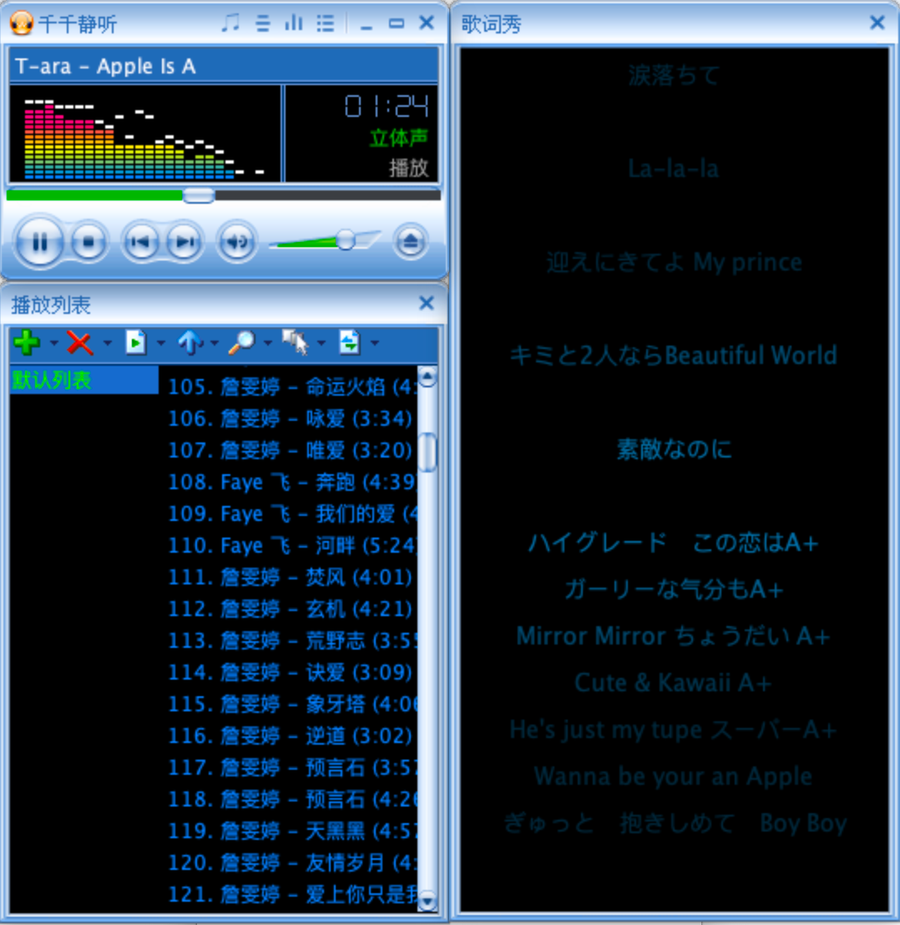
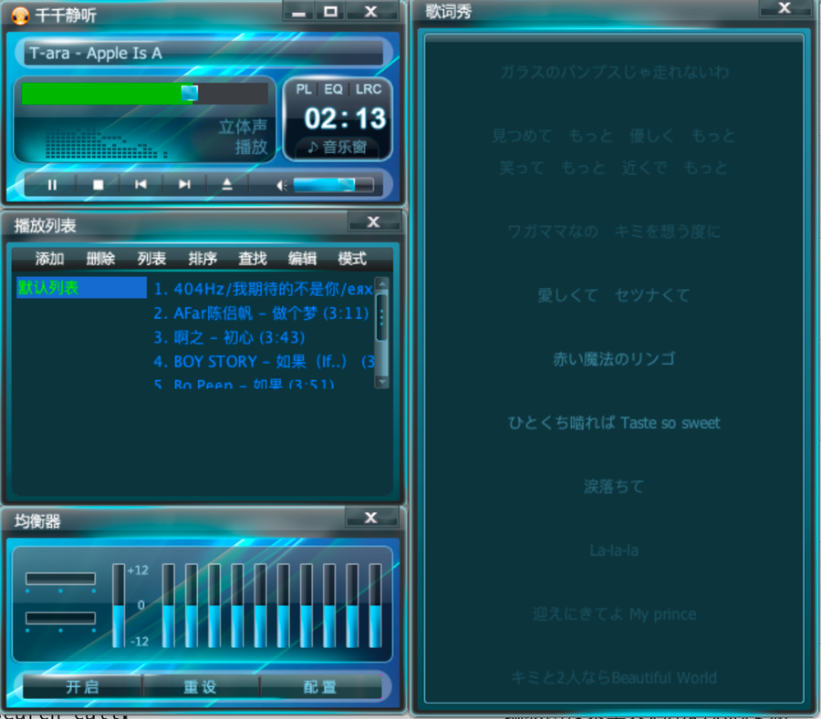
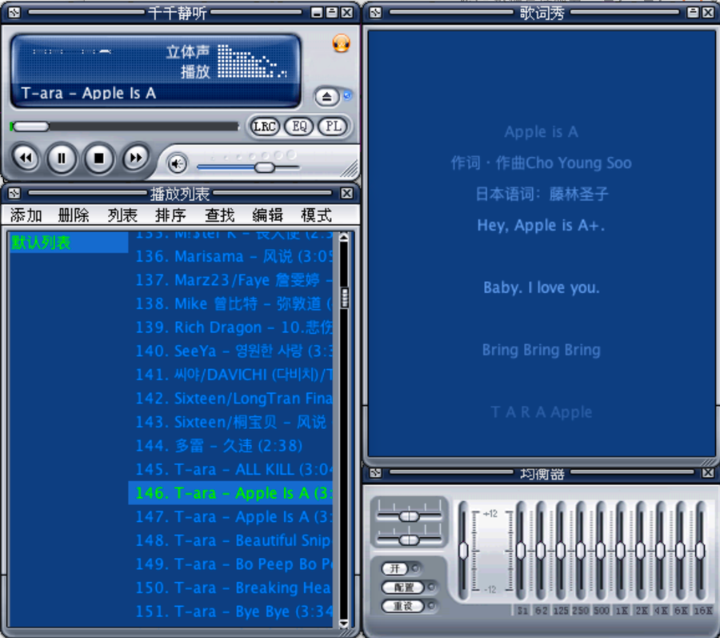
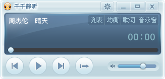
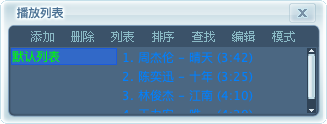
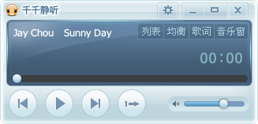

# TTPlayer — 千千静听复刻版 / A TTPlayer Clone

[中文](#中文) | [English](#english) | [日本語](#日本語) | [한국어](#한국어) | [Deutsch](#deutsch)

## 截图 / Screenshots

**实际运行截图 / Real screenshots**







**界面预览 / UI Preview**








---

# 中文

一款用 Java Swing 编写的桌面音乐播放器，致敬经典 **千千静听 (TTPlayer)**。支持本地音频播放、同步歌词、多皮肤切换、均衡器、频谱可视化等功能。界面支持**中文 / English / 日本語 / 한국어 / Deutsch 切换**。

## 功能特性

- **音频播放** — 基于 JavaCV（FFmpeg）解码 + `javax.sound` 输出，支持 MP3、FLAC、WAV、OGG 等多种格式，毫秒级 seek
- **播放列表** — 添加歌曲、拖放播放、上一首/下一首、播放列表持久化（自动保存/恢复）；支持 `PlayList.xml` 七色配置（`Color_Text/Hilight/Bkgnd/Number/Duration/Select/Bkgnd2`），序号、歌名、时长分色分段显示，隔行背景，歌名过长自动省略号；左右列表**可拖动分割条**调节宽度
- **同步歌词** — 独立歌词窗口，完全移植 c_ttplayer 渲染模型（当前行恒居中、距中心渐隐、卡拉OK 逐字高亮、行距随窗口自适应）；拖动歌词预览中心线与时间徽标，**释放即 seek 到目标行**；支持 `Lyric.xml` 的 `TextColor/HilightColor/BkgndColor/HilightWordColor` 配色
- **在线搜词** — 对接在线歌词接口，自动搜索并保存歌词到歌曲同目录；antd 风格搜索对话框（列表、专辑列、双击下载）
- **皮肤系统** — 完整的 .skn 皮肤加载，内置 60+ 款经典皮肤；拖入 .skn 文件可直接换肤；控件支持 `align` 组合对齐（`top+left` / `center+middle` / `fill` 拉伸等），窗口缩放时控件随尺寸重定位
- **均衡器** — 10 段图形均衡器（biquad），**启用开关 + 杜比环绕 + 13 种预设分类**（流行/摇滚/金属/电子…右键菜单选择），参数持久化下次恢复
- **频谱可视化** — 移植自 c_ttplayer 的 **8 种频谱模式**：柱状 / 波形 / 镜像柱 / 粒子 / 折线 / 面积 / 雷达 / LED 点阵，实时 FFT（RDFT），30fps 刷新
- **迷你模式** — 紧凑的迷你播放器，常驻屏幕右上角，可自定义皮肤（`mini_window` 配置）
- **多语言** — 中文 / English / 日本語 / 한국어 / Deutsch 界面切换（主菜单 / 选项 / 托盘菜单 → 语言）
- **自定义控件** — 皮肤驱动的按钮、滑块、滚动条、LED 数字显示等；歌词搜索 / 皮肤选择对话框均为 antd（Ant Design）风格

## 技术栈

| 组件 | 技术 |
|------|------|
| 语言 | Java 8 |
| UI | Swing（无边框窗口、半透明、自定义控件） |
| 音频解码 | JavaCV 1.5.9 + FFmpeg 6.0（按平台引入原生库） |
| 音频输出 | javax.sound (SourceDataLine) |
| 歌词搜索 | OkHttp 4.12 + 在线歌词 API |
| 元数据 | JavaCV (FFmpeg) |
| 国际化 | java.util.ResourceBundle（messages.properties + zh_CN / ja / ko / de） |
| 构建 | Maven (maven-shade-plugin 打包含全部依赖的 fat JAR) |

## 快速开始

### 环境要求

- JDK 8+
- Maven

### 构建与运行

```bash
# 克隆 / Clone
git clone https://github.com/tomj2ee/ttplayer.git
cd ttplayer

# 打包（自动按当前机器选择 FFmpeg 原生库，打成含全部依赖的可执行 fat jar）
mvn clean package

# 运行（三种方式任选）
java -jar target/ttplayer.jar
./ttplayer.sh          # macOS，带 Dock 图标
ttplayer.bat           # Windows
```

打包产物：`target/ttplayer.jar`（包含全部依赖和当前平台的 FFmpeg 原生库，可直接 `java -jar` 运行）。

### 按平台打包

FFmpeg 原生库按平台分别引入，体积比 `javacv-platform`（含全部平台）小得多。`pom.xml` 里已配置
`macosx-x86_64`、`macosx-arm64`、`windows-x86_64`、`linux-x86_64`、`linux-arm64` 多个 profile，
构建时按当前机器自动激活。

**一次打包所有平台**（每个平台一个独立 fat jar）：

```bash
mvn clean package -Pall
# 产物 / Output: target/ttplayer-1.0-SNAPSHOT-macosx-x86_64.jar
#                target/ttplayer-1.0-SNAPSHOT-macosx-arm64.jar
#                target/ttplayer-1.0-SNAPSHOT-windows-x86_64.jar
#                target/ttplayer-1.0-SNAPSHOT-linux-x86_64.jar
#                target/ttplayer-1.0-SNAPSHOT-linux-arm64.jar
```

**只打包单个平台**，用 `-Djavacpp.platform=xxx` 指定：

```bash
# Intel Mac
mvn clean package -Djavacpp.platform=macosx-x86_64

# Apple Silicon Mac
mvn clean package -Djavacpp.platform=macosx-arm64

# Windows x64 / Linux x64 / Linux ARM64
mvn clean package -Djavacpp.platform=windows-x86_64
mvn clean package -Djavacpp.platform=linux-x86_64
mvn clean package -Djavacpp.platform=linux-arm64
```

### 开发模式

直接在 IDE（IntelliJ IDEA）中打开项目，运行 `org.ttplayer.Main` 即可。

皮肤（`src/main/resources/skin/*.skn`）和图标会一起打进 jar，运行时从 classpath 读取；
打包后无需在 jar 外保留皮肤目录。

## 使用说明

1. **添加歌曲** — 点击播放列表工具栏"添加"，选择文件或文件夹；也可直接从 Finder/资源管理器拖入歌曲播放
2. **切换皮肤** — 主菜单 → 皮肤；或直接拖入 `.skn` 文件
3. **歌词** — 点击歌词按钮打开歌词窗口；右键搜索在线歌词；**拖动歌词行可预览并 seek**（松手跳到目标时间）
4. **播放列表** — 拖动左右列表之间的**分隔条**调节歌曲/列表显示宽度；悬停高亮
5. **迷你模式** — 在播放列表工具栏中切换到迷你模式
6. **均衡器** — 点击均衡器按钮；**右键菜单**可启用均衡器 / 杜比环绕 / 选择 13 种预设分类，参数自动保存
7. **频谱** — 点击频谱区域可在 8 种模式（柱状/波形/镜像/粒子/折线/面积/雷达/LED）间循环切换
8. **语言** — 主菜单或托盘菜单 → 语言 → 中文 / English / 日本語 / 한국어 / Deutsch

## 项目结构

```
src/main/java/org/ttplayer/
├── Main.java                    # 入口（系统属性 → 启动 TTPlayerApplication）
├── TTPlayerApplication.java     # 应用入口门面（瘦身后）
├── app/                         # 应用协调层（从 TTPlayerApplication 拆分）
│   ├── WindowHub.java           # 核心状态与门面（皮肤/引擎/窗口引用）
│   ├── WindowAssembler.java     # 窗口创建、关系绑定、图标、配置保存、按钮
│   ├── WindowLifecycle.java     # 显示恢复/迷你模式/换肤换语言重建/托盘联动
│   ├── TrayController.java      # 系统托盘
│   ├── FileDropController.java  # 文件拖放（音频导入 / .skn 换肤）
│   ├── PlayerEventListener.java # 播放器事件桥接（界面/歌词/状态持久化）
│   └── SongImportSupport.java   # 打开文件对话框导入歌曲（复用）
├── engine/
│   ├── PlayerEngine.java        # 音频播放引擎（JavaCV FFmpeg + javax.sound）
│   ├── Equalizer.java           # 10 段 biquad 均衡器 + 杜比环绕
│   └── EqualizerConfig.java     # 均衡器参数持久化
├── model/
│   ├── Song.java                # 歌曲模型
│   ├── Playlist.java            # 播放列表
│   ├── PlaylistManager.java     # 播放列表管理器
│   └── PlaylistConfig.java      # 播放列表持久化（XML）
├── skin/
│   └── TtSkin.java              # 皮肤加载与解析（.skn / ZIP / 目录）
├── ui/
│   ├── SkinWindow.java          # 皮肤窗口基类（九宫格缩放、BMP 镂空、align 对齐）
│   ├── PlayerWindow.java        # 主播放器窗口（含频谱）
│   ├── LyricWindow.java         # 歌词窗口
│   ├── LyricRenderer.java       # 歌词渲染（移植 c_ttplayer：恒居中 + 卡拉OK + 拖动 seek）
│   ├── EqualizerWindow.java     # 均衡器窗口（右键菜单 / 预设分类）
│   ├── PlaylistWindow.java      # 播放列表窗口（分隔条 / 七色列表）
│   ├── MiniWindow.java          # 迷你播放器窗口（皮肤驱动）
│   ├── DesktopLyricWindow.java  # 桌面歌词
│   ├── SkinSelectDialog.java    # 皮肤选择对话框（antd 按钮）
│   ├── LyricSearchDialog.java   # 在线歌词搜索对话框（antd 风格）
│   ├── SongDownloadDialog.java  # 歌曲搜索/下载对话框
│   └── controls/                # 皮肤驱动的自定义控件
│       ├── TtButton / TtHSlider / TtVSlider / TtTrackBar
│       ├── TtVolumeBar / TtScrollbar / TtToolbar / TtLed
│       ├── SkinScrollBarUI / TtToolbar
│       └── VirtualList.java     # 虚拟列表（Scrollable、分段颜色、省略号）
├── audio/
│   ├── TtRdft.java              # 实数 FFT（等价 FFmpeg AV_TX_FLOAT_RDFT）
│   ├── TtVisualizer.java        # 频谱可视化（8 种模式，移植自 c_ttplayer）
├── util/
│   ├── Messages.java            # 国际化消息（中英资源包）
│   ├── SnapUtils.java           # 窗口边缘吸附（内部拖拽语义识别）
│   ├── ColorUtils / FontUtils / UIUtils / WindowConfig
│   └── WindowLayoutUtils        # 窗口布局与图标的工具
└── lyrics/
    ├── LRCParser.java / LRCLine.java / LyricChar.java / SongResult.java
    ├── LyricSearchService.java  # 在线歌词搜索
    └── LyricAutoDownloader.java # 自动搜索下载歌词（可复用）
```

资源文件（`src/main/resources/`）：

- `skin/*.skn` — 内置皮肤
- `ico/*.png` — 图标
- `messages.properties` — 英文文案（默认）
- `messages_zh_CN.properties` — 中文文案
- `messages_ja.properties` — 日本語
- `messages_ko.properties` — 한국어
- `messages_de.properties` — Deutsch

## 皮肤

项目内置 60+ 款经典 TTPlayer 皮肤，位于 `src/main/resources/skin/` 目录。皮肤文件为 `.skn` 格式（ZIP 压缩包或目录），包含：

- `Skin.xml` — 窗口布局与控件定义
- BMP 图片 — 按钮、滑块、背景等所有 UI 元素
- `Player.xml`、`Equalizer.xml`、`PlayList.xml` 等子窗口配置

## License

本项目仅供学习和个人使用。皮肤资源版权归原作者所有。

---

# English

A desktop music player written in Java Swing, paying tribute to the classic **TTPlayer (千千静听)**.
It supports local audio playback, synced lyrics, skin switching, an equalizer, and spectrum visualization.
The UI supports **Chinese / English / 日本語 / 한국어 / Deutsch switching**.

## Features

- **Playback** — JavaCV (FFmpeg) decoding + `javax.sound` output; supports MP3, FLAC, WAV, OGG, and more
- **Playlist** — add songs, drag-and-drop, previous/next, persistence (auto save/restore); seven-color `PlayList.xml` styling (`Color_Text/Hilight/Bkgnd/Number/Duration/Select/Bkgnd2`), numbered/timed segments, alternating row background, title ellipsis, and a **draggable splitter** between list panes
- **Synced Lyrics** — ported from c_ttplayer's render model (current line always centered, distance fade, karaoke word highlight, adaptive line spacing); **drag a lyric line to preview and release to seek**; `Lyric.xml` color styling including `HilightWordColor`
- **Online Lyrics** — online lyric API search & download to the song directory; antd-styled search dialog
- **Skins** — full .skn loading, 60+ classic skins; drag a `.skn` to switch; control `align` combos (`top+left`, `center+middle`, `fill` stretch) for responsive resizing
- **Equalizer** — 10-band biquad EQ with **enable toggle, Dolby surround, 13 presets** via right-click menu; settings persist across restarts
- **Spectrum** — **8 visualization modes** ported from c_ttplayer (bars / wave / mirror / particles / line / area / radar / LED), real-time FFT (RDFT) at ~30fps
- **Mini Mode** — a compact mini player pinned to the top-right of the screen, skin-configurable
- **i18n** — switch UI language between 中文 / English / 日本語 / 한국어 / Deutsch (Main menu / tray → Language)
- **Custom Controls** — skin-driven buttons, sliders, scrollbars, LED digits, etc.; dialog suites styled with Ant Design

## Tech Stack

| Component | Technology |
|-----------|------------|
| Language | Java 8 |
| UI | Swing (frameless, translucent, custom controls) |
| Audio Decode | JavaCV 1.5.9 + FFmpeg 6.0 (platform-specific natives) |
| Audio Output | javax.sound (SourceDataLine) |
| Lyric Search | OkHttp 4.12 + online lyric API |
| Metadata | JavaCV (FFmpeg) |
| i18n | java.util.ResourceBundle (messages.properties + zh_CN / ja / ko / de) |
| Build | Maven (maven-shade-plugin fat JAR) |

## Quick Start

### Requirements

- JDK 8+
- Maven

### Build & Run

```bash
# Clone
git clone https://github.com/yourusername/ttplayer.git
cd ttplayer

# Build (auto-selects FFmpeg natives for the current platform, produces a runnable fat jar)
mvn clean package

# Run (pick one)
java -jar target/ttplayer.jar
./ttplayer.sh          # macOS, with Dock icon
ttplayer.bat           # Windows
```

Output: `target/ttplayer.jar` — contains all dependencies and the current platform's FFmpeg natives.

### Build for a Specific Platform

FFmpeg natives are added per platform (much smaller than `javacv-platform`). The `pom.xml` defines
`macosx-x86_64`, `macosx-arm64`, `windows-x86_64`, `linux-x86_64`, `linux-arm64` profiles, auto-activated by the build machine.

**Build all platforms at once** (one fat jar per platform):

```bash
mvn clean package -Pall
# Output: target/ttplayer-1.0-SNAPSHOT-macosx-x86_64.jar
#         target/ttplayer-1.0-SNAPSHOT-macosx-arm64.jar
#         target/ttplayer-1.0-SNAPSHOT-windows-x86_64.jar
#         target/ttplayer-1.0-SNAPSHOT-linux-x86_64.jar
#         target/ttplayer-1.0-SNAPSHOT-linux-arm64.jar
```

**Build a single platform** with `-Djavacpp.platform=xxx`:

```bash
# Intel Mac
mvn clean package -Djavacpp.platform=macosx-x86_64

# Apple Silicon Mac
mvn clean package -Djavacpp.platform=macosx-arm64

# Windows x64 / Linux x64 / Linux ARM64
mvn clean package -Djavacpp.platform=windows-x86_64
mvn clean package -Djavacpp.platform=linux-x86_64
mvn clean package -Djavacpp.platform=linux-arm64
```

### Development Mode

Open the project in an IDE (IntelliJ IDEA) and run `org.ttplayer.Main`.

Skins (`src/main/resources/skin/*.skn`) and icons are bundled into the jar and read from the classpath at runtime.

## Usage

1. **Add songs** — use the playlist toolbar "Add" button, or drag files/folders from Finder/Explorer onto any window
2. **Switch skin** — Main Menu → Skin; or drag a `.skn` file onto the player
3. **Lyrics** — click the lyrics button; right-click to search online lyrics; **drag a lyric line to preview and release to seek** to that time
4. **Playlist** — drag the **splitter** between list panes to resize; stays highlighted on hover
5. **Mini mode** — switch in the playlist toolbar
6. **Equalizer** — click the equalizer button; **right-click** to toggle EQ / Dolby surround / pick one of 13 presets (persisted)
7. **Spectrum** — click the spectrum area to cycle 8 modes (bars/wave/mirror/particles/line/area/radar/LED)
8. **Language** — Main menu or tray menu → Language → 中文 / English / 日本語 / 한국어 / Deutsch

## Project Structure

```
src/main/java/org/ttplayer/
├── Main.java                    # Entry (system props → start TTPlayerApplication)
├── TTPlayerApplication.java     # Slim app entry facade
├── app/                         # Application orchestration layer
│   ├── WindowHub.java           # Core state & coordinating facade
│   ├── WindowAssembler.java     # Window creation, relations, icons, config saving
│   ├── WindowLifecycle.java     # Restore/mini-mode/skin-language rebuild/tray show-hide
│   ├── TrayController.java      # System tray
│   ├── FileDropController.java  # Drag-and-drop (audio import / .skn switch)
│   ├── PlayerEventListener.java # Playback events → UI/lyrics/persistence
│   └── SongImportSupport.java   # Reusable open-and-add dialog
├── engine/
│   ├── PlayerEngine.java        # Audio engine (JavaCV FFmpeg + javax.sound)
│   ├── Equalizer.java           # 10-band biquad EQ + Dolby surround
│   └── EqualizerConfig.java     # EQ persistence
├── model/                       # Song / Playlist / PlaylistManager / PlaylistConfig
├── skin/
│   └── TtSkin.java              # Skin loading & parsing (.skn / ZIP / dir)
├── ui/
│   ├── SkinWindow.java          # Base (nine-patch, BMP keying, align layout)
│   ├── PlayerWindow.java        # Main player window (with spectrum)
│   ├── LyricWindow / LyricRenderer.java   # Lyrics + C-ported renderer
│   ├── EqualizerWindow.java     # EQ window (right-click menu/presets)
│   ├── PlaylistWindow.java      # Playlist (splitter, seven-color rows)
│   ├── MiniWindow / DesktopLyricWindow
│   ├── SkinSelectDialog / LyricSearchDialog / SongDownloadDialog
│   └── controls/                # Skin custom controls + VirtualList (Scrollable)
├── audio/
│   ├── TtRdft.java              # Real FFT (FFmpeg AV_TX_FLOAT_RDFT equivalent)
│   └── TtVisualizer.java        # 8 visualization modes (C port)
├── util/                        # Messages / SnapUtils / ColorUtils / FontUtils / UIUtils / WindowConfig / WindowLayoutUtils
└── lyrics/
    ├── LRCParser / LRCLine / LyricChar / SongResult
    ├── LyricSearchService.java  # Online lyric search
    └── LyricAutoDownloader.java # Automatic lyric fetch
```

Resources (`src/main/resources/`):

- `skin/*.skn` — bundled skins
- `ico/*.png` — icons
- `messages.properties` — English text (default)
- `messages_zh_CN.properties` — Chinese text

## Skins

The project bundles 60+ classic TTPlayer skins under `src/main/resources/skin/`. Skins are `.skn` files (ZIP archives or directories) containing:

- `Skin.xml` — window layout & control definitions
- BMP images — all UI elements (buttons, sliders, backgrounds)
- `Player.xml`, `Equalizer.xml`, `PlayList.xml` — per-window configs

## License

For learning and personal use only. Skin resources belong to their original authors.

---

# 日本語

Java Swing で書かれたデスクトップミュージックプレイヤー。クラシックな **千千静听 (TTPlayer)** に敬意を表したクローンです。MP3・FLAC・WAV・OGG などの再生、同期歌詞、スキン切り替え、イコライザー、スペクトル表示に対応。UI は **中文 / English / 日本語 / 한국어 / Deutsch** を切り替え可能。

## 機能

- **再生** — JavaCV (FFmpeg) デコード + `javax.sound` 出力
- **プレイリスト** — 曲の追加、ドラッグ＆ドロップ再生、リストの永続化
- **同期歌詞** — LRC 解析、オンライン歌詞検索
- **スキン** — 60+ の .skn スキンを内蔵
- **イコライザー** — 10バンドEQ・ドルビーサラウンド・13プリセット（右クリックメニュー）
- **スペクトル** — 8種の表示モード（柱状/波形/粒子/レーダー/LED など）
- **マルチ言語** — メインメニュー / トレイ → 言語

## ビルド

```bash
mvn clean package
java -jar target/ttplayer.jar
```

## ライセンス

学習・個人利用のみ。スキン資源の著作権は原作者に帰属します。

---

# 한국어

Java Swing으로 작성된 데스크톱 뮤직 플레이어. 클래식 **千千静听 (TTPlayer)** 클론입니다. MP3·FLAC·WAV·OGG 재생, 동기화 가사, 스킨 전환, 이퀄라이저, 스펙트럼 표시를 지원합니다. UI는 **中文 / English / 日本語 / 한국어 / Deutsch** 전환이 가능합니다.

## 기능

- **재생** — JavaCV (FFmpeg) 디코딩 + `javax.sound` 출력
- **재생 목록** — 곡 추가, 드래그 앤 드롭 재생, 목록 저장
- **동기화 가사** — LRC 파싱, 온라인 가사 검색
- **스킨** — .skn 스킨 60+ 내장
- **이퀄라이저** — 10밴드 EQ·돌비 서라운드·13 프리셋 (우클릭 메뉴)
- **스펙트럼** — 8가지 표시 모드 (바/파형/파티클/레이더/LED 등)
- **다국어** — 메인 메뉴 / 트레이 → 언어

## 빌드

```bash
mvn clean package
java -jar target/ttplayer.jar
```

## 라이선스

학습 및 개인 용도로만 사용하세요. 스킨 리소스의 저작권은 원저작자에게 있습니다.

---

# Deutsch

Ein mit Java Swing geschriebener Desktop-Musikplayer, eine Hommage an den Klassiker **千千静听 (TTPlayer)**. Unterstützt MP3/FLAC/WAV/OGG-Wiedergabe, synchrone Liedtexte, Skin-Wechsel, Equalizer und Spektrumanzeige. Die UI kann zwischen **中文 / English / 日本語 / 한국어 / Deutsch** umgeschaltet werden.

## Funktionen

- **Wiedergabe** — JavaCV (FFmpeg) Decoding + `javax.sound` Ausgabe
- **Wiedergabeliste** — Songs hinzufügen, per Drag & Drop abspielen, Listen speichern
- **Synchrone Liedtexte** — LRC-Parsing, Online-Liedtextsuche
- **Skins** — 60+ .skn-Skins enthalten
- **Equalizer** — 10-Band-EQ · Dolby Surround · 13 Presets (Kontextmenü)
- **Spektrum** — 8 Anzeigemodi (Balken/Welle/Partikel/Radar/LED u. a.)
- **Mehrsprachig** — Hauptmenü / Tray → Sprache

## Build

```bash
mvn clean package
java -jar target/ttplayer.jar
```

## Lizenz

Nur für Lern- und Privatzwecke. Die Rechte an den Skin-Ressourcen liegen bei ihren ursprünglichen Autoren.

